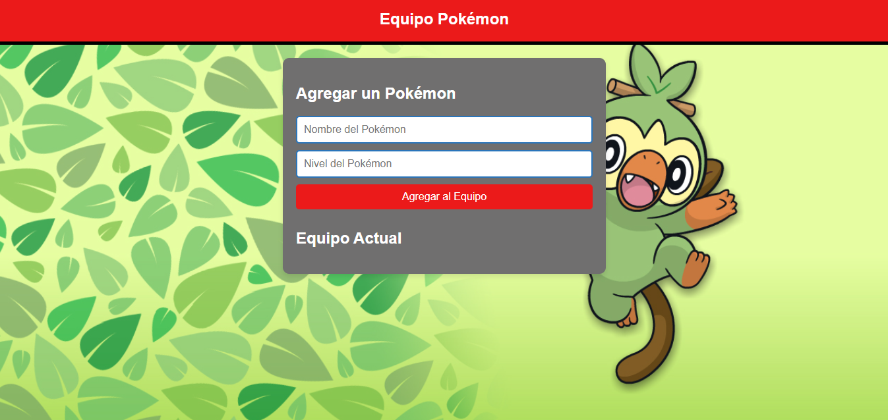
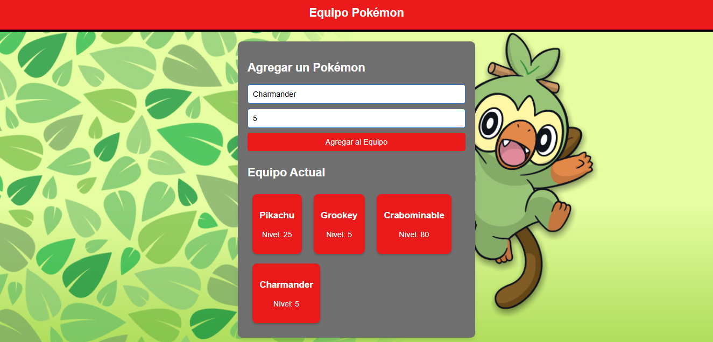

# Taller 1 | AREP

## Diseño y Estructuración de Aplicaciones Distribuidas en Internet

Durante este taller se escribió un servidor web que soporta múltiples solicitudes seguidas no concurrentes. El servidor lee los archivos del disco local y retorna todos los archivos solicitados, incluyendo HTML, JavaScript, CSS e imágenes. Se construyó una aplicación web con los archivos anteriormente mencionados para probar el servidor. En la aplicación se incluye la comunicación asíncrona con unos servicios REST en el backend. NO se usaron frameworks web como Spark o Spring, solo Java y las librerías para manejo de la red.

## Architecture

La arquitectura utilizada se alinea con el patrón de Cliente - Servidor, en el cual existe un servidor que aloja todos los recursos y uno o más clientes pueden acceder y usar estos recursos por medio de solicitudes que son respondidas con los servicios REST del Backend.


## Getting Started

Estas instrucciones te permitirán obtener una copia del proyecto en funcionamiento en tu máquina local para desarrollo y pruebas.

### Prerequisites
Para ejecutar este proyecto se necesita lo siguiente:

- Java 21 o superior
- Maven 3.8.1 o superior
- Un navegador web

Si cuenta con un IDE de Java en su equipo como NetBeans, IntelliJ, VS Code, entre otros basta con descargar el proyecto y ejecutarlo desde el IDE.

### Installing

Puede descargar el archivo .zip del proyecto directamente desde GitHub. Si prefiere clonar el repositorio desde la terminal necesitará tener git en su dispositivo, lo puede hacer con el siguiente comando desde git bash:
```
git clone https://github.com/jcontreras2693/AREP-Lab1.git
``` 
En caso de no contar con un IDE de Java necesitará tener Maven instalado en su dispositivo e ingresar a la carpeta raíz del proyecto descargado, ejecute los siguientes comandos de Maven desde la terminal:
```
mvn clean compile
```
```
mvn exec:java -Dexec.mainClass="org.example.PokemonServer"
```

El proceso de instalación habrá sido exitoso si ve un mensaje como este en su consola de comandos.


Finalmente, ingresa desde un navegador a la dirección [localhost:35000]() para interactuar con la aplicación web.

Ejemplo de la página inicial.


Ejemplo del funcionamiento de la aplicación.


## Running the Tests

Las pruebas realizadas verifican los getters y setters de la clase Pokemon. Además del GET y POST del servidor web.

Para ejecutar las pruebas desde la consola se utiliza el siguiente comando:

```
mvn test
```

Si las pruebas fueron exitosas verá un mensaje como este en su consola de comandos.


## Authors

* **Juan David Contreras Becerra** - *Taller 1 | AREP* - [AREP-Lab1](https://github.com/jcontreras2693/AREP-Lab1.git)

## Acknowledgements

* **Billie Thompson** - *README template* - [PurpleBooth](https://github.com/PurpleBooth)